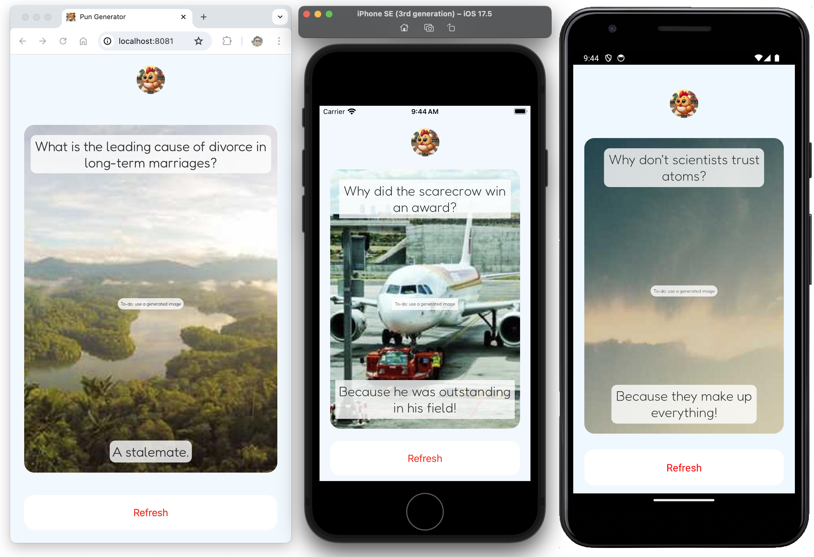

# AI Pun Generator

AI Pun Generator is an application developed using React Native and Ollama. It serves as a basic demonstration of using text generation to create an unscripted app experience. Users can interact with the application across **iOS**, **Android**, and **Web**.

# Features
* **Unlimited Puns:** Generate puns using AI by hitting the 'refresh' button.

# Usage

To use the application, follow these steps:

1. Install [Ollama](https://github.com/ollama/ollama) and run Llama3


2. Clone the repository:
```Terminal
npx expo start
```

3. Install dependencies:
```Terminal
cd ai-pun-generator
npm install
```

4. Start the development server
```Terminal
npm start
```

5. Adjust `Database.js` to match your Llama3 server IP address and port number.  
```
const response = await fetch('<YOUR_IP_ADDRESS_AND_PORT_HERE>/api/generate' ...
```


# Screenshots




# Personal Notes

I did this as a project to learn about **React Native**, **Prompt Engineering**, and **interacting with LLMs within applications**.  It is full of comments, commented out codes, and other unnecessary things. Feedback is appreciated.

If you'd like to contribute to the project, feel free to fork the repository and submit a pull request with your changes.


# License

This project is licensed under the MIT License - see the [License](LICENSE) file for details.